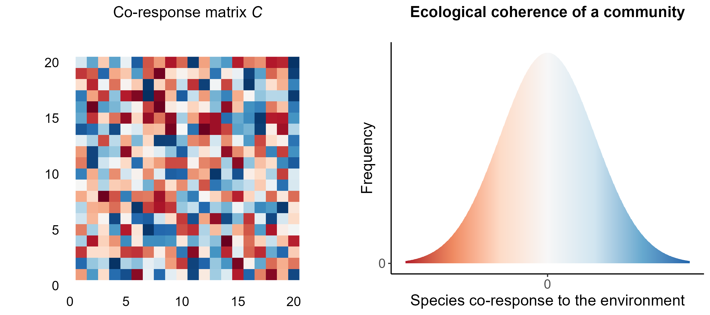

```{r, echo=FALSE}
library(ggplot2)
library(RColorBrewer)
library(ggpubr)
library(MASS)
library(reshape2)
library(dplyr)
library(tidyr)
library(viridis)

my_theme<-theme(axis.text=element_text(size=12),
        axis.title = element_text(size = 14),
        legend.text=element_text(size=10),
        legend.title = element_text(size=12),
        plot.title = element_text(face="bold",size=14,margin=margin(0,0,20,0),hjust = 0.5),
        axis.title.y = element_text(hjust = 0.5),
        axis.title.x = element_text(hjust = 0.5))
```

### Motivation

Global change inflicts strong changes in the environment that species adapt to. Globally, species' populations, distributions, and phenology is being highly altered. These changes can add, eliminate, or alter the strength and sign of interactions affecting community composition and structure, and therefore its functioning. Given the complexity of biodiversity and the challenge of its measurement, how can we anticipate changes of those properties?

Contemporary empirical investigations (ref) and theoretical advancements (ref) are highlighting the importance of evaluating the degree of shared responses to the environment across multiple species within ecological communities (commonly referred to as community synchrony; refs). This integrated approach underscores the interconnectedness of species dynamics and their collective impact on ecosystem stability (ref). Despite advancements in understanding the impacts of community synchrony, the incorporation of information on the interaction network structures remains lacking. Simultaneously, understanding how ecosystem functioning depends on network structure remains limited (Walther 2010, Montoya & Raffaelli 2010), as it necessitates information on species’ dynamics driven by more factors than interactions (Lavergne et al. 2010; Tylianakis & Morris 2017; Strydom et al. 2021; Purves et al. 2013; Harfoot et al. 2014). There is therefore a pressing need for theory and tools that comprehensively integrate the interconnected dynamics of species and their collective impact on ecosystem stability to anticipate changes in the structure and function of communities.

### Objective: 

In this study, we introduce the concept of Ecological Network Coherence (ENC), which provides a conceptual framework for capturing the correlational structure of species’ interdependent responses to the environment in an ecological network. The concept is manifested in an empirical community-level pattern that results from the shared responses to environmental variables among interacting species. We propose that this empirical pattern could help predicting the potential for disruptions in ecosystem functioning and serve as a foundational element for developing a new indicator of the consequences of biodiversity changes at the community level. Our primary objectives encompass (1) defining ENC and its components, (2) exploring its quantitative application to ecosystem functioning, and (4) illustrating how to measure and explore it in empirical data.

### Concept definition

Species responses to environmental changes include alterations in population trends, spatial distribution shifts, and phenology changes (Bellard et al., 2012). Consequently, ecological communities are characterized by heterogeneous responses, which can be summarized as a distribution of species responses:


```{r, echo=FALSE}

set.seed(123)

data <- data.frame(response = seq(-3, 3, length.out = 1000))
data$frequency <- dnorm(data$response)


plot_distrib_resp <- ggplot(data, aes(x = response, y = frequency, fill = response)) +
  geom_tile(aes(y = frequency / 2, height = frequency, width = 0.01)) +
  scale_fill_distiller(palette = "RdBu", limits = c(-3, 3), direction = 1) +
  labs(x = "Species response to the environment", y = "Frequency", title = "Species Responses to the Environment") +
  theme_classic() +
  xlim(-3, 3) +
  scale_x_continuous(breaks = 0) +
  scale_y_continuous(breaks = c(0, 1)) +
  theme(legend.position = "none",
        plot.title = element_text(hjust = 0.5)) +
  my_theme

plot_distrib_resp

#ggsave("fig1.png", height = 4, width = 5)

```


The above example illustrates a hypothetical community where species responses are perfectly balanced, with most species would showing minimal response to environmental changes, while a minority exhibit strong positive or negative responses. 

From this, we can assess the similarities and differences in species responses, or their co-responses. Species co-responses can be characterized based on their covariance: a positive covariance indicates that greater values of one variable typically correspond to greater values of the other, while a negative covariance suggests an inverse relationship. Correlation is a standardized version of covariance that adjusts the data to have a mean of 0 and a standard deviation of 1 (bounded between -1 and 1), providing a more straightforward interpretation of the relationship's strength and direction. Species co-responses within a community can be summarized in a matrix,$C$, which comprises pairwise correlations. The distribution of these co-responses forms a community pattern that we define as the Ecological Coherence of the community, reflecting how coherent species responses are to the environment.


```{r, echo=FALSE}

set.seed(123)

matrix_size <- 20
data_matrix <- expand.grid(x = 1:matrix_size, y = 1:matrix_size)
data_matrix$value <- runif(nrow(data_matrix), min = -3, max = 3)

# Plot

palette <- colorRampPalette(brewer.pal(11, "RdBu"))(100)

plot_matrix_c <- ggplot(data_matrix, aes(x = x, y = y, fill = value)) +
  geom_raster() +
  scale_fill_gradientn(colors = palette, limits = c(-3, 3)) +
  labs(x = NULL, y = NULL, title = expression("Co-response matrix"~italic("C"))) +
  theme_classic() +
  theme(
    legend.position = "none",
    axis.text = element_blank(),
    axis.title = element_blank(),
    axis.ticks = element_blank(),  
    axis.line = element_blank(),   
    plot.title = element_text(hjust = 0.5)
  ) +
  coord_fixed()+
  my_theme


plot_coresponses <- ggarrange(plot_matrix_c,
                              plot_distrib_resp + labs(x = "Species co-response to the environment", y = "Frequency", title = "Ecological coherence of a community"),
                              ncol = 2, nrow = 1
                              )

plot_coresponses

#ggsave("fig2.png", height = 4, width = 9)

```



We can incorporate information on community structure by considering the co-responses between pairs of interacting species: the matrix $C$ can be filtered out (multiplied) by the adjacency matrix of interactions $A$, which denotes the presence or absence of interactions. The distribution of the resulting filtered co-response matrix is a pattern that shows the degree of co-responses to specific environmental variables between interacting species within a community at given location in space and time, which we define as Ecological Network Coherence.

```{r}


# Add probabilities of black (presence) and white (absence) squares to the A matrix based on the values in C

data_matrix$color <- ifelse(data_matrix$value > 0, 
                            sample(c("black", "white"), size = nrow(data_matrix), replace = TRUE, prob = c(0.7, 0.3)),
                            sample(c("black", "white"), size = nrow(data_matrix), replace = TRUE, prob = c(0.3, 0.7)))

# Plot 
plot_matrix_A <- ggplot(data_matrix, aes(x = x, y = y, fill = color)) +
  geom_raster() +
  scale_fill_manual(values = c("black" = "black", "white" = "white")) +
  labs(x = NULL, y = NULL, title = expression("Interaction matrix"~italic("A"))) +
  theme_classic() +
  theme(
    legend.position = "none",
    axis.text = element_blank(),
    axis.title = element_blank(),
    axis.ticks = element_blank(),  # Remove axis ticks
    axis.line = element_blank(),    # Remove axis lines
    plot.title = element_text(hjust = 0.5)
  ) +
  coord_fixed()+
  my_theme


# Define parameters for the new distribution
set.seed(42)  
mean_new <- 1  # Shift the distribution to the right
sd_new <- 1.2  # Change the standard deviation

# Generate new data
data_new <- data.frame(
  response = seq(-3, 3, length.out = 1000),
  frequency = dnorm(seq(-3, 3, length.out = 1000), mean = mean_new, sd = sd_new)
)


plot_distrib_resp <- ggplot(data_new, aes(x = response, y = frequency, fill = response)) +
  geom_tile(aes(y = frequency / 2, height = frequency, width = 0.05)) +  # Adjust width to better visualize the shape
  scale_fill_distiller(palette = "RdBu", limits = c(-3, 3), direction = 1) +
  labs(x = "Interactioning species co-response", y = "Frequency", title = "Ecological Network Coherence") +
  theme_classic() +
  xlim(-3, 3) +
  scale_x_continuous(breaks = 0) +
  scale_y_continuous(breaks = c(0, 1)) +
  theme(legend.position = "none",
        plot.title = element_text(hjust = 0.5))+
  my_theme


plot_ENC <- ggarrange(
  plot_matrix_c,
  plot_matrix_A,
  plot_distrib_resp,
  
  ncol = 3, 
  nrow = 1
)

plot_ENC


#ggsave("fig3.png", height = 4, width = 11)

```


By summarizing the pattern of species co-responses and interactions in a community distribution, ENC brings the possibility to analyze the predictive consequences of different statistical modes on functioning. Summarizing the complex interdependence of species responses in a distribution also brings the advantage to bridge empirical and theoretical work: ENC is built from commonly measured data and used by empirisist and is manifested in a clear statistical object that can be explored.


# Linking ENC to ecosystem functioning


Let $X_i$ be the abundance of species $i$ in a Lotka-Volterra system, with intrinsic growth rate $r_i$ and interaction coefficient with species $j$ given by $a_{ij}$. We can write the dynamics of species $i$ as: $$
\frac{dX_i}{dt} = X_i \left[ r_i - \sum_j a_{ij} X_j \right] \tag{1}
$$

Assuming the existence of an equilibrium and that all $n$ species have non-zero abundances at equilibrium, we can write the equation for all species at equilibrium using vector notations (i.e. with arrows): $$
\overrightarrow{r} = A.\overrightarrow{X^*} \tag{2}
$$ which, if the system is sufficiently not pathological, can be inverted: $$
\overrightarrow{X^*} = A^{-1}.\overrightarrow{r} \tag{3}
$$

If a push perturbation $\overrightarrow{\Delta r}$ is applied to the system over a sufficiently long time, we thus expect the equilibrium to shift away from $\overrightarrow{X^*}$ by a quantity $\overrightarrow{\Delta X}$, given by: $$
\overrightarrow{\Delta X} = A^{-1}.\overrightarrow{\Delta r} \tag{4}
$$

Now assuming that $\overrightarrow{\Delta r}$ is random among species, i.e. that the effect of the perturbation on each and every species is drawn from an underlying distribution, we can call $\overline{\Delta r}$ the mean push perturbation and $\mathbb{V}(\Delta r)$ the variance of push perturbation among species. For commodity, we note $\overrightarrow{1}$ the vector comprising as many 1's as the number of species in the system, and $T$ is used as the symbol for transposition.

$$
\overline{\Delta r} = \frac{1}{n}\overrightarrow{1}^T.\overrightarrow{\Delta r} \tag{5}
$$

$$
\begin{split}
    \mathbb{V}(\Delta r) &= \left( \overrightarrow{\Delta r}-\frac{1}{n}\overrightarrow{1}^T.\overrightarrow{\Delta r} \overrightarrow{1}\right)^T.\left( \overrightarrow{\Delta r}-\frac{1}{n}\overrightarrow{1}^T.\overrightarrow{\Delta r} \overrightarrow{1}\right)\\
    &= \overrightarrow{\Delta r}^T.\overrightarrow{\Delta r} - \left(\frac{2}{n} -\frac{1}{n^2} \right) \left( \overrightarrow{1}^T.\overrightarrow{\Delta r}\right)^2\\
    &= \overrightarrow{\Delta r}^T.\overrightarrow{\Delta r} - (2n-1)\left( \overline{\Delta r}\right)^2
\end{split} \tag{6}
$$

In the same way, we can define $\overline{\Delta X}$ the mean abundance change due to the perturbation and $\mathbb{V}(\Delta X)$ the variance of these abundance changes among species.

$$
\overline{\Delta X} = \frac{1}{n}\overrightarrow{1}^T.\overrightarrow{\Delta X} \tag{7}
$$

$$
\begin{split}
    \mathbb{V}(\Delta X) &= \left( \overrightarrow{\Delta X}-\frac{1}{n}\overrightarrow{1}^T.\overrightarrow{\Delta X} \overrightarrow{1}\right)^T.\left( \overrightarrow{\Delta X}-\frac{1}{n}\overrightarrow{1}^T.\overrightarrow{\Delta X} \overrightarrow{1}\right)\\
    &= \overrightarrow{\Delta X}^T.\overrightarrow{\Delta X} - \left(\frac{2}{n} -\frac{1}{n^2} \right) \left( \overrightarrow{1}^T.\overrightarrow{\Delta X}\right)^2
\end{split} \tag{8}
$$

Hereafter, we use the notation $B = A^{-1}$ in order to look at the effect of $A$ on changes in abundances at equilibrium. Getting back to equation $(4)$ and developing the sums, we get: $$
\begin{split}
\overline{\Delta X} &= \frac{1}{n} \sum_i \sum_j b_{ij} \Delta r_j\\
&= \frac{1}{n} \sum_j \Delta r_j \left( \sum_i b_{ij} \right)
\end{split} \tag{9}
$$ In this final expression, we recognize the average (*sensu* "among all species") of the product of the $\Delta r$ and the column sums of $B$. Hence, if we further decompose this using the abusive $\mathbb{E}$ and $cov$ notations (expectations are to be understood as averages over columns): $$
\overline{\Delta X} = \mathbb{E}\left[ \overrightarrow{1}^T B\right]\mathbb{E}\left[ \overrightarrow{\Delta r}\right] + cov\left( \overrightarrow{1}^T B, \overrightarrow{\Delta r}\right) \tag{10}
$$

Adopting the perspective where the vector $\overrightarrow{\Delta r}$ is a random vector that follows a multivariate distribution with mean vector and covariances between vector components, we can use the propagation of uncertainty to deduce that:

$$
\text{var}\left( \Delta X_i \right) \approx \sum_k \sum_l b_{ik} b_{il} \text{cov}\left( \Delta r_k, \Delta r_l \right) \tag{11}
$$

$$
\text{cov}\left( \Delta X_i, \Delta X_j \right) \approx \sum_k \sum_l b_{ik} b_{jl} \text{cov}\left( \Delta r_k, \Delta r_l \right) \tag{12}
$$

with (as above) $B = A^{-1}$ the inverse of the LV interaction matrix.

### Predictions - effect of ENC on the predictability of community dynamics

We demonstrated mathematically how ENC links to changes in abundances of species in a community (equation $10$) and the predictability of this changes (equation $11$). We then explore whether different 

As a first approach to investigating the consequences of ENC on ecosystem functioning, we demonstrate mathematically how it links to changes in abundance and its predictability (variance in abundance changes) in a Lotka Volterra system submitted to a push perturbation.

Equation (11) captures how the covariances of perturbation responses among all species in the network contribute to the variance in abundance changes for a focal species $i$. The equation sums up the contributions of all pairs of species ($k$ and $l$) to the variance of the abundance change of species $i$. This means that the variance in abundance changes for a focal species $i$ is influenced by how all other species in the network respond to perturbations (as captured by the covariances $cov( \Delta r_k, \Delta r_l)$ and how these responses propagate through the network (as captured by the elements of the matrix $B$).

Upon a perturbation, we get $\Delta r$ for each species.

Therefore, the covariance matrix ${Cov}(\vec{\Delta r})$ is:

$$
C = \begin{bmatrix}
cov(\vec{\Delta r_1}, \vec{\Delta r_1}) & cov(\vec{\Delta r_1}, \vec{\Delta r_2}) & \cdots & cov(\vec{\Delta r_1}, \vec{\Delta r_k}) \\
cov(\vec{\Delta r_2}, \vec{\Delta r_1}) & cov(\vec{\Delta r_2}, \vec{\Delta r_2}) & \cdots & cov(\vec{\Delta r_2}, \vec{\Delta r_k}) \\
\vdots & \vdots & \ddots & \vdots \\
cov(\vec{\Delta r_k}, \vec{\Delta r_1}) & cov(\vec{\Delta r_k}, \vec{\Delta r_2}) & \cdots & cov(\vec{\Delta r_k}, \vec{\Delta r_k})
\end{bmatrix}
$$

### Breaking down the scenarios

<br> <br>

The net effect on variance is the result of complex interactions between species' responses to perturbations and their interaction coefficients, which can either amplify or reduce the variance depending on the specific configuration.

#### 1. $b_{ik}$ and $b_{il}$ have the same sign

<br>

-   $b_{ik}b_{il}$ is positive.
-   If **Positive covariance** ($cov( \Delta r_k, \Delta r_l)$ \> 0), the term $b_{ik} b_{il} cov( \Delta r_k, \Delta r_l)$ will be positive.
-   If **Negative covariance** ($cov( \Delta r_k, \Delta r_l)$ \< 0), the term $b_{ik} b_{il} cov( \Delta r_k, \Delta r_l)$ will be negative.

Positive covariance increases the overall variance $var( \Delta X_i)$, potentially making the system less predictable, whereas negative covariance has the contrary effect.

#### 2. $b_{ik}$ and $b_{il}$ have opposite signs

<br>

-   $b_{ik}b_{il}$ is negative.
-   If **Positive covariance** ($cov( \Delta r_k, \Delta r_l)$ \> 0), the term $b_{ik} b_{il} cov( \Delta r_k, \Delta r_l)$ will be negative.
-   If **Negative covariance** ($cov( \Delta r_k, \Delta r_l)$ \< 0), the term $b_{ik} b_{il} cov( \Delta r_k, \Delta r_l)$ will be positive.

Positive covariance decreases the overall variance $var( \Delta X_i)$, potentially making the system more predictable, whereas negative covariance has the contrary effect.

 

#### 3. Heterogeneity of interaction effects

The scenarios discussed apply to communities where most interactions between species are either predominantly positive or negative. However, in empirical ecological communities, the net effects of interactions are often heterogeneous, with interaction effects (positive or negative) varying widely. 


```{r}

# Function to simulate quantitative networks
sim_quantitative_network <- function(Net_type, S, C, aij_params, rho = 0, diag_type) {
  A <- matrix(0, S, S)
  n_pairs <- S * (S - 1) / 2
  B <- runif(n_pairs) <= C
  if (Net_type == "random") {
    A[upper.tri(A)] <- B * rnorm(n_pairs, aij_params[1], aij_params[2])
    A <- t(A)
    A[upper.tri(A)] <- B * rnorm(n_pairs, aij_params[1], aij_params[2])
  } else if (Net_type == "predator-prey") {
    aij <- -abs(rnorm(n_pairs, aij_params[1], aij_params[2]))
    A[upper.tri(A)] <- B * aij
    A <- t(A)
    aij <- abs(rnorm(n_pairs, aij_params[1], aij_params[2]))
    A[upper.tri(A)] <- B * aij
  } else if (Net_type == "competition") {
    aij <- -abs(rnorm(n_pairs * 2, aij_params[1], aij_params[2]))
    A[upper.tri(A)] <- B * aij[1:n_pairs]
    A <- t(A)
    A[upper.tri(A)] <- B * aij[(n_pairs + 1):length(aij)]
  } else if (Net_type == "mutualistic") {
    aij <- abs(rnorm(n_pairs * 2, aij_params[1], aij_params[2]))
    A[upper.tri(A)] <- B * aij[1:n_pairs]
    A <- t(A)
    A[upper.tri(A)] <- B * aij[(n_pairs + 1):length(aij)]
  } else {
    stop("Incorrect network type")
  }
  
  if(diag_type == "zero"){
    diag(A) <- 0
  } else {
    diag(A) <- -(max(Re(eigen(A)$values)) + runif(S, 0.1))
    while (max(Re(eigen(A)$values)) > 0) {
      diag(A) <- -(max(Re(eigen(A)$values)) + runif(S, 0.1))
    }
  }
  
  return(A)
}


# Parameters
S <- 25  # Number of species
C <- 0.3  # Connectivity
aij_params <- c(0, 1)  # Mean and SD for interaction strengths

# Generate matrices
A_foodweb <- sim_quantitative_network("predator-prey", S, C, aij_params, diag_type = "nonzero")
A_competition <- sim_quantitative_network("competition", S, C, aij_params, diag_type = "nonzero")
A_mutualistic <- sim_quantitative_network("mutualistic", S, C, aij_params, diag_type = "nonzero")

# Invert matrices
B_foodweb <- solve(A_foodweb)
B_competition <- solve(A_competition)
B_mutualistic <- solve(A_mutualistic)

# Function to plot matrices
plot_matrix <- function(mat, title) {
  max_val <- max(abs(mat), na.rm = TRUE)
  mat_melt <- as.data.frame(as.table(mat))
  mat_melt$Var1 <- factor(mat_melt$Var1, levels = rev(levels(mat_melt$Var1))) # Reverse the y-axis order
  ggplot(mat_melt, aes(Var2, Var1, fill = Freq)) +
    geom_tile(color = "white") +
    scale_fill_distiller(palette = "RdBu", direction = 1, na.value = "white", limits = c(-max_val, max_val)) +
    labs(x = NULL, y = NULL, fill = "Value", title = title) +
    theme_minimal() +
    theme(axis.text = element_blank(), axis.ticks = element_blank(), plot.title = element_text(hjust = 0.5)) +
    coord_fixed(ratio = 1)  # Ensure the matrix is square
}

# Create plots
p1 <- plot_matrix(A_foodweb, "Food Web A")
p2 <- plot_matrix(B_foodweb, "Food Web B")
p3 <- plot_matrix(A_competition, "Competition A")
p4 <- plot_matrix(B_competition, "Competition B")
p5 <- plot_matrix(A_mutualistic, "Mutualistic A")
p6 <- plot_matrix(B_mutualistic, "Mutualistic B")

pA <- ggarrange(p1,
                p3,
                p5,
                ncol = 1,
                nrow = 3,
                common.legend = TRUE)

pB <- ggarrange(p2,
                p4,
                p6,
                ncol = 1,
                nrow = 3,
                common.legend = TRUE)

# Arrange plots in a grid
ggarrange(pA, pB, ncol = 2, nrow = 1,
          labels = LETTERS[1:2])

#ggsave("fig4.1.png", height = 8, width = 5)

```


This heterogeneity in interaction coefficients* means that any covariance structure will result in both increases and decreases in abundance variance. The strength of coherence will modulate the magnitude of these changes in variance: small covariances are likely to decrease changes in variance, while large covariances will increase them. This leads to two general predictions: first, the heterogeneous nature of real-world interactions makes the overall impact of coherence on stability complex and challenging to predict. Second, ENC patterns with strong coherence will reduce the predictability of communities and increase the potential for significant disruptions in their structure and function. 


*Seems that this is not the case for mutualistic networks, whose B matrix does not contain positive values:

```{r}
# Function to test if a matrix contains any negative values
contains_positive_values <- function(mat) {
  any(mat > 0)
}

# Simulate 100 mutualistic networks and test for negative values

positive_values_found <- numeric(length = 1000)

for (i in 1:1000) {
  A <- sim_quantitative_network("mutualistic", S, C, aij_params, diag_type = "nonzero")
  B <- solve(A)
  positive_values_found[i] <- contains_positive_values(B)
}

# Check the results
sum(positive_values_found) # Number of B matrices containing negative values
```


## Simulations to test predictions

We simulate 100 food web structures with random interaction strengths and compute the abundance change and variance in abundance change according to formulas $10$ and $11$. We test different covariance structures: strong negative, weak negative, null (zero covariance), weak positive, strong positive, weak mixed (positive and negative), and strong mixed. Based on our mathematical intuition, we expect to find that the variance in abundance change is higher for the scenarios with strong positive, strong negative, and strong mixed covariances, and lower for weak positive, weak negative, and null covariances.


Covariance matrices:

```{r}
# Number of species
S <- 25

# Simulate initial r values (ri)
set.seed(123)
ri <- runif(S, -1, 1)

# Function to generate rf values with positive covariance
generate_rf_positive <- function(ri, mean_change, sd_variation) {
  rf <- ri + rnorm(length(ri), mean_change, sd_variation)
  return(rf)
}

# Mixed (positive and negative)
generate_rf_mixed <- function(ri, mean_change_positive, mean_change_negative, sd_variation) {
  rf <- ri
  for (i in 1:length(ri)) {
    if (i %% 2 == 0) {
      rf[i] <- ri[i] + rnorm(1, mean_change_positive, sd_variation)
    } else {
      rf[i] <- ri[i] + rnorm(1, mean_change_negative, sd_variation)
    }
  }
  return(rf)
}

# Compute the covariance matrix using delta_r vectors
compute_cov_matrix <- function(delta_r_vectors) {
  S <- nrow(delta_r_vectors)
  cov_matrix <- matrix(NA, nrow = S, ncol = S)
  for (i in 1:S) {
    for (j in 1:S) {
      cov_matrix[i, j] <- cov(delta_r_vectors[i, ], delta_r_vectors[j, ])
    }
  }
  return(cov_matrix)
}

# Generate rf values for different scenarios
mean_change_strong <- 1.2
mean_change_weak <- 0.5
sd_variation <- 0.1

# Strong positive
rf_strong_positive <- generate_rf_positive(ri, mean_change_strong, sd_variation)
delta_r_strong_positive <- rf_strong_positive - ri

# Weak positive
rf_weak_positive <- generate_rf_positive(ri, mean_change_weak, sd_variation)
delta_r_weak_positive <- rf_weak_positive - ri

# Mixed weak
mean_change_positive <- 0.5
mean_change_negative <- -0.5
rf_mixed_weak <- generate_rf_mixed(ri, mean_change_positive, mean_change_negative, sd_variation)
delta_r_mixed_weak <- rf_mixed_weak - ri

# Mixed strong
mean_change_positive_strong <- 1.2
mean_change_negative_strong <- -1.2
rf_mixed_strong <- generate_rf_mixed(ri, mean_change_positive_strong, mean_change_negative_strong, sd_variation)
delta_r_mixed_strong <- rf_mixed_strong - ri

# Null (no change)
delta_r_null <- rep(0, S)
delta_r_vectors_null <- cbind(ri, ri)  # No change, so rf = ri

# Create vectors delta_r for each species (each row corresponds to a species)
delta_r_vectors_strong_positive <- cbind(ri, rf_strong_positive)
delta_r_vectors_weak_positive <- cbind(ri, rf_weak_positive)
delta_r_vectors_mixed_weak <- cbind(ri, rf_mixed_weak)
delta_r_vectors_mixed_strong <- cbind(ri, rf_mixed_strong)

# Compute C matrices
cov_matrix_strong_positive <- compute_cov_matrix(delta_r_vectors_strong_positive)
cov_matrix_weak_positive <- compute_cov_matrix(delta_r_vectors_weak_positive)
cov_matrix_mixed_weak <- compute_cov_matrix(delta_r_vectors_mixed_weak)
cov_matrix_mixed_strong <- compute_cov_matrix(delta_r_vectors_mixed_strong)
cov_matrix_null <- matrix(0, nrow = S, ncol = S)  # Null scenario has no change

# Combine all covariance matrices into a list
cov_matrices <- list(
  "Strong Positive" = cov_matrix_strong_positive,
  "Weak Positive" = cov_matrix_weak_positive,
  "Mixed Weak" = cov_matrix_mixed_weak,
  "Mixed Strong" = cov_matrix_mixed_strong,
  "Null" = cov_matrix_null
)

# Prepare the plot data for the example C matrices
prepare_plot_data <- function(cov_matrices) {
  plot_data <- lapply(names(cov_matrices), function(name) {
    matrix <- cov_matrices[[name]]
    df <- melt(matrix)
    df$Scenario <- name
    return(df)
  })
  combined_plot_data <- do.call(rbind, plot_data)
  return(combined_plot_data)
}

# Generate the plot data
plot_data <- prepare_plot_data(cov_matrices)

# Generate the plot
p <- ggplot(plot_data, aes(x = Var1, y = Var2, fill = value)) +
  geom_tile(color = "white") +
  scale_fill_distiller(palette = "RdBu", direction = 1, na.value = "white") +
  labs(
    x = NULL,
    y = NULL,
    fill = "Covariance"
  ) +
  theme_minimal() +
  theme(strip.text = element_text(size = 14)) +
  facet_wrap(~ Scenario, ncol = 3, scales = "free") +
  my_theme

# Display the plot
print(p)

#ggsave("fig5.png", height = 7, width = 10)

```

Simulations (similar results for mutualistic, competition, and predator-prey interactions):

```{r}
# Number of species
S <- 25

# Simulate initial r values (ri)
set.seed(123)
ri <- runif(S, -1, 1)

# Function to generate rf values with positive covariance
generate_rf_positive <- function(ri, mean_change, sd_variation) {
  rf <- ri + rnorm(length(ri), mean_change, sd_variation)
  return(rf)
}

# Function to generate rf values with Mixed covariance (positive and negative)
generate_rf_mixed <- function(ri, mean_change_positive, mean_change_negative, sd_variation) {
  rf <- ri
  for (i in 1:length(ri)) {
    if (i %% 2 == 0) {
      rf[i] <- ri[i] + rnorm(1, mean_change_positive, sd_variation)
    } else {
      rf[i] <- ri[i] + rnorm(1, mean_change_negative, sd_variation)
    }
  }
  return(rf)
}

# Compute the covariance matrix using delta_r vectors
compute_cov_matrix <- function(delta_r_vectors) {
  S <- nrow(delta_r_vectors)
  cov_matrix <- matrix(NA, nrow = S, ncol = S)
  for (i in 1:S) {
    for (j in 1:S) {
      cov_matrix[i, j] <- cov(delta_r_vectors[i, ], delta_r_vectors[j, ])
    }
  }
  return(cov_matrix)
}

# Simulating scenarios
mean_change_strong <- 1.2
mean_change_weak <- 0.5
sd_variation <- 0.1

# Function to simulate quantitative networks
sim_quantitative_network <- function(Net_type, S, C, aij_params, rho = 0, diag_type) {
  A <- matrix(0, S, S)
  n_pairs <- S * (S - 1) / 2
  B <- runif(n_pairs) <= C
  if (Net_type == "random") {
    A[upper.tri(A)] <- B * rnorm(n_pairs, aij_params[1], aij_params[2])
    A <- t(A)
    A[upper.tri(A)] <- B * rnorm(n_pairs, aij_params[1], aij_params[2])
  } else if (Net_type == "predator-prey") {
    aij <- -abs(rnorm(n_pairs, aij_params[1], aij_params[2]))
    A[upper.tri(A)] <- B * aij
    A <- t(A)
    aij <- abs(rnorm(n_pairs, aij_params[1], aij_params[2]))
    A[upper.tri(A)] <- B * aij
  } else if (Net_type == "competition") {
    aij <- -abs(rnorm(n_pairs * 2, aij_params[1], aij_params[2]))
    A[upper.tri(A)] <- B * aij[1:n_pairs]
    A <- t(A)
    A[upper.tri(A)] <- B * aij[(n_pairs + 1):length(aij)]
  } else if (Net_type == "mutualistic") {
    aij <- abs(rnorm(n_pairs * 2, aij_params[1], aij_params[2]))
    A[upper.tri(A)] <- B * aij[1:n_pairs]
    A <- t(A)
    A[upper.tri(A)] <- B * aij[(n_pairs + 1):length(aij)]
  } else {
    stop("Incorrect network type")
  }
  
  if(diag_type == "zero"){
    diag(A) <- 0
  } else {
    diag(A) <- -(max(Re(eigen(A)$values)) + runif(S, 0.1))
    while (max(Re(eigen(A)$values)) > 0) {
      diag(A) <- -(max(Re(eigen(A)$values)) + runif(S, 0.1))
    }
  }
  
  return(A)
}

# Function to calculate metrics
calculate_metrics <- function(B, cov_delta_r, delta_r) {
  n <- nrow(B)
  
  # Variance of Delta X
  var_delta_X <- numeric(n)
  for (i in 1:n) {
    var_sum <- 0
    for (k in 1:n) {
      for (l in 1:n) {
        var_sum <- var_sum + B[i, k] * B[i, l] * cov_delta_r[k, l]
      }
    }
    var_delta_X[i] <- var_sum
  }
  
  # Compute column sums of B
  col_sums_B <- colSums(B)
  
  # Average of the sum of each column of B
  mean_sum_B <- mean(col_sums_B)
  
  # Mean of delta_r (assuming it is an average of a random distribution)
  mean_delta_r <- mean(delta_r)
  
  # Covariance between sum of each column of B and delta_r
  cov_sum_B_delta_r <- cov(col_sums_B, delta_r)
  
  # Calculate Abundance Change
  abundance_change <- mean_sum_B * mean_delta_r + cov_sum_B_delta_r
  
  return(list(Variance = var_delta_X, Abundance_Change = abundance_change))
}

# Run simulations
run_simulations_with_metrics <- function(num_simulations, Net_type, S, C, aij_params, scenario, mean_change_strong, mean_change_weak, sd_variation) {
  results <- replicate(num_simulations, {
    # Generate new C matrix for each iteration
    if (scenario == "Strong Positive") {
      rf <- generate_rf_positive(ri, mean_change_strong, sd_variation)
    } else if (scenario == "Weak Positive") {
      rf <- generate_rf_positive(ri, mean_change_weak, sd_variation)
    } else if (scenario == "Null") {
      rf <- ri
    } else if (scenario == "Mixed Weak") {
      rf <- generate_rf_mixed(ri, mean_change_weak, -mean_change_weak, sd_variation)
    } else if (scenario == "Mixed Strong") {
      rf <- generate_rf_mixed(ri, mean_change_strong, -mean_change_strong, sd_variation)
    }
    
    delta_r <- rf - ri
    delta_r_vectors <- cbind(ri, rf)
    cov_matrix <- compute_cov_matrix(delta_r_vectors) # compute C matrix from delta_r vectors
    
    interaction_matrix <- sim_quantitative_network(Net_type, S, C, aij_params, diag_type = "nonzero")
    inverse_matrix <- solve(interaction_matrix)
    if (is.null(inverse_matrix)) {
      return(list(Variance = rep(NA, S), Abundance_Change = NA))
    }
    
    metrics <- calculate_metrics(inverse_matrix, cov_matrix, delta_r)
    list(metrics = metrics, A_matrix = interaction_matrix, B_matrix = inverse_matrix, C_matrix = cov_matrix)
  }, simplify = FALSE)
  
  list(results = lapply(results, function(res) res$metrics), 
       A_matrices = lapply(results, function(res) res$A_matrix), 
       B_matrices = lapply(results, function(res) res$B_matrix), 
       C_matrices = lapply(results, function(res) res$C_matrix))
}

# Generate results for each scenario
Net_type <- "predator-prey"
C <- 0.2
aij_params <- c(0, 0.1)
num_simulations <- 100

scenarios <- c("Strong Positive", "Weak Positive", "Null", "Mixed Weak", "Mixed Strong")

simulation_results_with_metrics <- lapply(scenarios, function(scenario) {
  run_simulations_with_metrics(num_simulations, Net_type, S, C, aij_params, scenario, mean_change_strong, mean_change_weak, sd_variation)
})


# Prepare the matrices data
prepare_matrices_data <- function(simulation_results) {
  df_list_matrices <- lapply(names(simulation_results), function(scenario) {
    A_matrices <- simulation_results[[scenario]]$A_matrices
    B_matrices <- simulation_results[[scenario]]$B_matrices
    C_matrices <- simulation_results[[scenario]]$C_matrices
    df <- data.frame(
      Scenario = rep(scenario, length(A_matrices)),
      A_matrix = I(A_matrices),
      B_matrix = I(B_matrices),
      C_matrix = I(C_matrices)
    )
    return(df)
  })
  combined_df_matrices <- bind_rows(df_list_matrices)
  return(combined_df_matrices)
}

# Prepare the matrices data
combined_matrices_data <- prepare_matrices_data(setNames(simulation_results_with_metrics, scenarios))


###################################################

# Prepare the data for plotting
prepare_combined_plot_data <- function(simulation_results) {
  df_list_var <- lapply(names(simulation_results), function(scenario) {
    data <- simulation_results[[scenario]]$results
    df <- data.frame(
      Scenario = scenario,
      Variance = unlist(lapply(data, function(res) res$Variance)),
      Abundance_Change = unlist(lapply(data, function(res) res$Abundance_Change))
    )
    return(df)
  })
  combined_df_var <- bind_rows(df_list_var)
  combined_df_var <- combined_df_var %>% filter(!is.na(Variance) & !is.na(Abundance_Change))
  
  return(combined_df_var)
}

# Prepare the data
combined_plot_data <- prepare_combined_plot_data(setNames(simulation_results_with_metrics, scenarios))

# Plot results
scenario_order <- c(
  "Strong Positive",
  "Weak Positive",
  "Null",
  "Mixed Weak",
  "Mixed Strong"
)

combined_plot_data$Scenario <- factor(combined_plot_data$Scenario, levels = scenario_order)

# Define color palette based on RdBu
color_palette <- scales::brewer_pal(palette = "RdBu", direction = -1)(5)
mixed_weak_color <- "violet"
mixed_strong_color <- "magenta4"

# Define scenario colors
scenario_order <- c("Strong Positive", "Weak Positive", "Null", "Mixed Weak", "Mixed Strong")
scenario_colors <- setNames(c(color_palette[1], color_palette[2], color_palette[3], mixed_weak_color, mixed_strong_color), scenario_order)


# Plot abundance change
p1 <- ggplot(combined_plot_data, aes(x = Scenario, y = Abundance_Change, fill = Scenario)) +
  geom_jitter(width = 0.2, alpha = 0.1, shape = 21, size = 2, aes(color = Scenario)) +
  scale_fill_manual(values = scenario_colors) +
  scale_color_manual(values = c(setNames(ifelse(scenario_order == "Null", "black", scenario_colors), scenario_order), "black")) +
  geom_hline(yintercept = 0, linetype = "dashed", color = "red") +
  labs(x = " ", y = "Abundance Change") +
  theme_classic() +
  theme(axis.text.x = element_text(angle = 45, hjust = 1), legend.position = "none") +
  my_theme

# Plot variance in abundance change
p2 <- ggplot(combined_plot_data, aes(x = Scenario, y = Variance, fill = Scenario)) +
  geom_jitter(width = 0.2, alpha = 0.1, shape = 21, size = 2, aes(color = Scenario)) +
  scale_fill_manual(values = scenario_colors) +
  scale_color_manual(values = c(setNames(ifelse(scenario_order == "Null", "black", scenario_colors), scenario_order), "black")) +
  labs(x = " ", y = "Variance in Abundance Change") +
  theme_classic() +
  theme(axis.text.x = element_text(angle = 45, hjust = 1), legend.position = "none") +
  my_theme

# Display plots
ggarrange(p1, p2, nrow = 2, ncol = 1, labels = LETTERS[1:2])


#ggsave("fig6.png", height = 10, width = 6)


```


The simulations confirm the expectation that the predictability of a community of interacting species increases when coherence is low (i.e. as values around 0 increase in the ENC pattern), whereas it decreases as coherence increases (i.e. as values approach the extremes -1 and 1 in the ENC pattern).


---------------------------------

The covariance contribution in Formula 10, $cov\left( \overrightarrow{1}^T B, \overrightarrow{\Delta r}\right)$, suggests that species with higher centrality or influence within the interaction network (as captured by the $B$ matrix) and their corresponding responses ($\overrightarrow{\Delta r}$) significantly impact the overall change in abundance. If species that are central in the network exhibit major responses to perturbations, this will likely lead to substantial changes in community abundance.


```{r}


# Define a grid for influence and response
influence <- seq(-2, 2, length.out = 100)
response <- seq(-2, 2, length.out = 100)

# Create a dataframe with all combinations of influence and response
grid <- expand.grid(influence = influence, response = response)

# Compute the covariance contribution for each combination
grid$covariance <- grid$influence * grid$response

# Create the plot
ggplot(grid, aes(x = influence, y = response, fill = covariance)) +
  geom_tile() +
  scale_fill_gradient2(low = "blue", high = "red", mid = "white", midpoint = 0, 
                       limit = c(-4, 4), space = "Lab", 
                       name = "Covariance\nContribution") +
  geom_vline(xintercept = 0, linetype = "dashed", color = "black") +
  geom_hline(yintercept = 0, linetype = "dashed", color = "black") +
  annotate("text", x = 1.5, y = 1.5, label = "(+,+)", size = 6, color = "black") +
  annotate("text", x = -1.5, y = 1.5, label = "(-,+)", size = 6, color = "black") +
  annotate("text", x = -1.5, y = -1.5, label = "(-,-)", size = 6, color = "black") +
  annotate("text", x = 1.5, y = -1.5, label = "(+,-)", size = 6, color = "black") +
  labs(x = "Influence", y = "Response", title = "Influence vs Response with Covariance Contribution") +
  theme_minimal()

```

```{r}

# Parameters
S <- 20  # Number of species
C <- 0.3  # Connectivity
aij_params <- c(0, 1)  # Mean and SD for interaction strengths
net_type <- "random"  # Type of network

# Simulate the interaction matrix A
A <- sim_quantitative_network(net_type, S, C, aij_params, diag_type = "nonzero")

# Compute the inverse matrix B
B <- solve(A)

# Generate a random response vector Delta_r
Delta_r <- rnorm(S, 0, 1)

# Compute the influence and response for plotting
influence <- rowSums(B)  # Sum of rows in B
response <- Delta_r  # Response vector

# Scale the influence and response to fall within [-2, 2]
scale_to_range <- function(x, new_min = -2, new_max = 2) {
  old_min <- min(x)
  old_max <- max(x)
  (x - old_min) / (old_max - old_min) * (new_max - new_min) + new_min
}

influence <- scale_to_range(influence)
response <- scale_to_range(response)

# Generate a grid for the underlying color field
x <- seq(-2, 2, length.out = 100)
y <- seq(-2, 2, length.out = 100)
grid <- expand.grid(influence = x, response = y)
grid$covariance <- grid$influence * grid$response  # Covariance contribution

# Convert real network data to a data frame
real_data <- data.frame(influence = influence, response = response)

# Create the plot
ggplot(grid, aes(x = influence, y = response, fill = covariance)) +
  geom_tile() +
  scale_fill_gradient2(low = "blue", high = "red", midpoint = 0, 
                       limit = c(-4, 4), space = "Lab", 
                       name = expression(paste("Covariance\nContribution\nto", bar(Delta), "X"))) +
  geom_vline(xintercept = 0, linetype = "dashed", color = "black") +
  geom_hline(yintercept = 0, linetype = "dashed", color = "black") +
  annotate("text", x = 1.5, y = 1.5, label = "(+,+)", size = 6, color = "black") +
  annotate("text", x = -1.5, y = 1.5, label = "(-,+)", size = 6, color = "black") +
  annotate("text", x = -1.5, y = -1.5, label = "(-,-)", size = 6, color = "black") +
  geom_point(data = real_data, aes(x = influence, y = response), color = "black", size = 2, inherit.aes = FALSE) +
  annotate("text", x = 1.5, y = -1.5, label = "(+,-)", size = 6, color = "black") +
  labs(x = "Influence", y = "Response", title = "Influence vs Response with Covariance Contribution") +
  theme_minimal() +
  theme(plot.title = element_text(hjust = 0.5))


```

